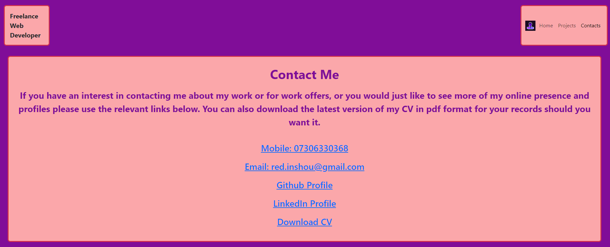

# my-react-profile

## Description

I have authored this webpage so that it can serve as a home for my professional portfolio and profile.

I want to have the design and content showcase my proficiency in web-development with React, Bootstrap and client-side navigation React-Router.

This project gives me the control of the look and content of my online portfolio and also serves as a portfolio piece in itself.

Whilst doing this project I learned how tricky it can be to use media queries to make the content responsive to all viewing devices.  It is far easier to accomplish this with Bootstrap5 and React.

## Table of Contents

Included for your ease of use is a table of contents

- [Installation](#installation)
- [Usage](#usage)
- [Credits](#credits)
- [Screenshots](#screenshots)
- [License](#license)

## Installation
  
If you wish to work on the files for this project on your local machine you can clone it onto your machine with following commands:

```Git clone command```  
```
git clone git@github.com:kevinstaresdarbon/my-react-profile.git
cd my-react-profile
npm install -y
npm run dev
```
and then usually you will need to open a browser to the url: "localhost:5173"
to view the contents of the project whilst you work on the code.

if you simply wish to view my profile page you can use this link:  
[my-react-profile](https://kevinstaresdarbon.github.io/my-react-profile/)

## Usage
  
This webpage constitutes my profile and contains my image, my name, links to my work and links with which to contact me and download my cv in pdf format.  
  
If you are interested in my works please contact me using the links provided.

If you wish to build your own portfolio around the design of this site I ask that you completely remove all my personal data and images from the code before republishing the site anywhere.
  
## Credits
  
The starter code at the initial starter commit was generated using the command:

```create vite command```  
```
npm create vite@latest -- --template react
```

and then i followed this guide here: 
[configuring-github-with-vite](https://www.youtube.com/watch?v=tg-Xgx-lqXM&ab_channel=idlefreak01)
to complete the deployment.

All commits after that is original work done by myself.  
No collaboration was needed or taken on this repository and code.

Much of it was a refactor of my old bootstrap portfolio:  
[Bootstrap_KS-D_Profile](https://kevinstaresdarbon.github.io/Bootstrap_KS-D_Profile/)

I used [colormind.io](http://colormind.io/) to develop the theme colors for this website  
  
I used <https://www.icongeneratorai.com/> to generate the favicon png  
  
The template and advice for this README was adapted from my previous profile and taken from this site:  
<https://coding-boot-camp.github.io/full-stack/github/professional-readme-guide>  
  
## Screenshots  
  
Below are the screenshots of the website on each page:  
  
Full Desktop 1920x1080:  
  
   
  
  
  
  

  
## License  
  
MIT License citation is supplied [HERE](./LICENSE)